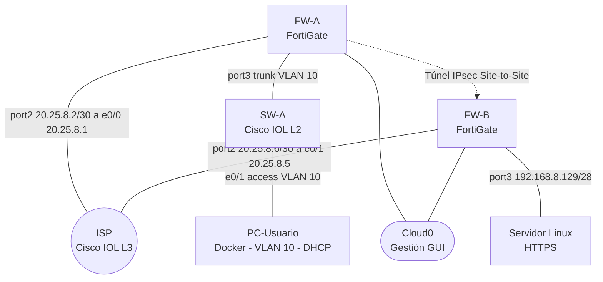
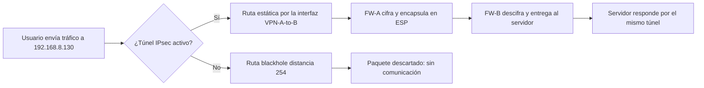

# Práctica 2 – VPN Site-to-Site con FortiGate (Infraestructura 1)

> ▶ **Video demostrativo:** [https://youtu.be/Fb0aanVwJzY] 

| | |
|---|---|
| **Estudiante** | Aaron Hernandez |
| **Matrícula** | 2025-0800 |
| **Institución** | Instituto Tecnológico de las Américas (ITLA) |
| **Tarea** | Seguridad de Redes – Tarea Semana 3 (Práctica 2), Infraestructura 1 |
| **Plataforma** | PNETLab |
| **Fecha** | Octubre 2026 |

---

## Índice

1. [Propósito del laboratorio](#1-propósito-del-laboratorio)
2. [Topología](#2-topología)
3. [Dispositivos y conexiones](#3-dispositivos-y-conexiones)
4. [Direccionamiento IP](#4-direccionamiento-ip)
5. [Cumplimiento de requisitos](#5-cumplimiento-de-requisitos)
6. [Configuración paso a paso](#6-configuración-paso-a-paso)
7. [Verificación y pruebas](#7-verificación-y-pruebas)
8. [Consideraciones de seguridad](#8-consideraciones-de-seguridad)
9. [Problemas encontrados y soluciones](#9-problemas-encontrados-y-soluciones)
10. [Estructura del repositorio](#10-estructura-del-repositorio)
11. [Conclusiones](#11-conclusiones)
12. [Anexo A – Comandos de verificación utilizados](#12-anexo-a--comandos-de-verificación-utilizados)
13. [Anexo B – Configuración aplicada (running-configs)](#13-anexo-b--configuración-aplicada-running-configs)

---

## 1. Propósito del laboratorio

Este laboratorio implementa y demuestra una **VPN IPsec Site-to-Site entre dos firewalls FortiGate** que conecta dos sitios a través de un ISP con direcciones IP públicas. Un usuario del Sitio A (VLAN 10, red /25, con DHCP) debe poder alcanzar un servidor web HTTPS del Sitio B (red /28) **únicamente a través del túnel VPN**.

**Objetivos:**

1. Comunicar el Usuario con el Servidor a través del enlace VPN.
2. Comprobar que la comunicación **solo fluye si el enlace VPN está activo**.
3. Configurar red y NAT en ambos FortiGate, **todo mediante la interfaz gráfica (GUI)**.
4. Segmentar el Sitio A con una VLAN 10 (red /25) con servidor DHCP, y el Sitio B con una red /28 para el servidor.
5. Demostrar la ruta hacia el servidor con una prueba de traceroute.

**Objetivo de seguridad:** el tráfico entre los dos sitios viaja cifrado por el túnel IPsec y, si el túnel cae, el firewall descarta el tráfico (ruta *blackhole*) en lugar de enviarlo sin cifrar por el ISP.

---

## 2. Topología

### Diagrama lógico



### Diagrama de decisión del tráfico (por qué solo fluye con la VPN activa)




## 3. Dispositivos y conexiones

### Dispositivos

| Nodo | Rol | Plataforma / imagen | Interfaces usadas |
|---|---|---|---|
| **ISP** | Router del proveedor (red pública) | Cisco IOL L3 | e0/0, e0/1 |
| **FW-A** | FortiGate del Sitio A (usuarios) | FortiGate VM64-KVM (FortiOS 6.4.x) | port1 gestión, port2 WAN, port3 LAN |
| **FW-B** | FortiGate del Sitio B (servidor) | FortiGate VM64-KVM (FortiOS 6.4.x) | port1 gestión, port2 WAN, port3 LAN |
| **SW-A** | Switch de usuarios (VLAN 10) | Cisco IOL L2 | e0/0 trunk, e0/1 acceso |
| **PC-Usuario** | Cliente | Docker `pnetlab/ubuntu_sv:latest` | eth1 (eth0 es la gestión fija de PNETLab) |
| **Servidor Linux** | Servidor web HTTPS | Nodo Linux de PNETLab | e0 (eth0 en el sistema) |

### Conexiones (cableado)

| Desde | Hacia |
|---|---|
| FW-A port2 | ISP e0/0 |
| FW-B port2 | ISP e0/1 |
| FW-A port3 | SW-A e0/0 (trunk) |
| SW-A e0/1 | PC-Usuario eth1 |
| FW-B port3 | Servidor Linux e0 |
| FW-A port1 y FW-B port1 | Cloud0 (solo para acceder a la GUI desde el equipo anfitrión) |

---

## 4. Direccionamiento IP

El direccionamiento se derivó de la matrícula **2025-0800**: las redes privadas usan el octeto `8` (de "08") y las redes públicas del ISP usan `20.25.8.x` (de "2025-08").

| Segmento | Red | Uso |
|---|---|---|
| Usuarios (VLAN 10) | `192.168.8.0/25` | Hosts .1 a .126, broadcast .127 |
| Servidor | `192.168.8.128/28` | Hosts .129 a .142, broadcast .143 |
| Enlace ISP–FW-A (pública) | `20.25.8.0/30` | ISP .1, FW-A .2 |
| Enlace ISP–FW-B (pública) | `20.25.8.4/30` | ISP .5, FW-B .6 |

| Dispositivo | Interfaz | Dirección |
|---|---|---|
| ISP | e0/0 | 20.25.8.1/30 |
| ISP | e0/1 | 20.25.8.5/30 |
| FW-A | port2 (WAN) | 20.25.8.2/30 |
| FW-A | VLAN10-USUARIOS (sobre port3) | 192.168.8.1/25 (gateway y servidor DHCP) |
| FW-B | port2 (WAN) | 20.25.8.6/30 |
| FW-B | port3 (LAN) | 192.168.8.129/28 (gateway) |
| PC-Usuario | eth1 | DHCP, rango .10 a .100 (ej. 192.168.8.11/25) |
| Servidor Linux | eth0 | 192.168.8.130/28 (estática), gateway 192.168.8.129 |

---

## 5. Cumplimiento de requisitos

| Requisito de la tarea | Cómo se cumple | Sección |
|---|---|---|
| Repositorio de GitHub | Este repositorio | — |
| Video al principio del repositorio | Enlace en la primera línea de este README | Inicio |
| Documentación con imágenes | Capturas numeradas en ` /` | Todo el documento |
| Documentación con diagramas | Dos diagramas Mermaid (topología y decisión del tráfico) | 2 |
| Propósito del laboratorio | Propósito y objetivos | 1 |
| Scripts en el repositorio | Carpeta `scripts/` | 10 |
| Running-configs en el repositorio | Carpeta `running-configs/` y Anexo B | 10 y 13 |
| 2 FortiGate configurados por GUI | Toda la configuración por GUI (única excepción: acceso inicial, ver 6.1) | 6 |
| Configuraciones de red | Interfaces, VLAN, rutas, DHCP | 6.4 y 6.5 |
| NAT | Políticas con NAT habilitado en ambos FortiGate | 6.4, 6.5 y 7.2 |
| VPN Site-to-Site entre los FortiGate | Asistente IPsec en ambos | 6.6 |
| ISP con IPs públicas | Enlaces 20.25.8.0/30 y 20.25.8.4/30 | 4 y 6.2 |
| 1 servidor web /28 con HTTPS | 192.168.8.128/28, HTTPS en el puerto 443 | 6.7 |
| 1 usuario /25, VLAN 10 y DHCP | VLAN 10 sobre port3, DHCP en FW-A | 6.4 y 6.8 |
| Traceroute hacia el servidor | Prueba con TTL creciente | 7.3 |
| Comunicación solo con VPN activa | Pruebas con la VPN activa y caída | 7.1, 7.4 y 7.5 |
| Direccionamiento basado en la matrícula | Redes derivadas de 2025-0800 | 4 |

---

## 6. Configuración paso a paso

### 6.1 Acceso inicial a los FortiGate (única parte por consola)

Para poder abrir la GUI hace falta una dirección de gestión. En ambos FortiGate se inició sesión por consola (`admin`, contraseña vacía), se definió la nueva contraseña que pide el sistema y se configuró **solo** la interfaz de gestión `port1` (conectada a Cloud0). Todo lo demás se configuró por GUI.

```
config system global
 set admin-https-redirect disable
end
config system interface
 edit port1
  set mode dhcp
  set defaultgw disable
  set allowaccess ping http https ssh
 next
end
get system interface physical
```

`defaultgw disable` evita que la ruta por defecto de gestión choque con la ruta hacia el ISP. La licencia de evaluación de la VM limita el acceso administrativo por HTTPS, por eso la GUI se abre por `http://<IP de port1>`.

### 6.2 ISP (Cisco IOL L3)

```
enable
configure terminal
hostname ISP
no ip domain-lookup
interface Ethernet0/0
 description A-FW-A
 ip address 20.25.8.1 255.255.255.252
 no shutdown
interface Ethernet0/1
 description A-FW-B
 ip address 20.25.8.5 255.255.255.252
 no shutdown
end
write memory
```

El ISP **no tiene rutas hacia las redes privadas** 192.168.8.0/25 ni 192.168.8.128/28: solo conoce sus dos enlaces públicos. Por eso el servidor solo es alcanzable a través de la VPN.


### 6.3 SW-A (Cisco IOL L2): VLAN 10

```
enable
configure terminal
hostname SW-A
no ip domain-lookup
vlan 10
 name USUARIOS
interface Ethernet0/0
 switchport trunk encapsulation dot1q
 switchport mode trunk
 switchport trunk allowed vlan 10
 no shutdown
interface Ethernet0/1
 switchport mode access
 switchport access vlan 10
 spanning-tree portfast
 no shutdown
end
write memory
```

### 6.4 FW-A por GUI

**System > Settings:** Host name `FW-A`.

**Network > Interfaces**

| Interfaz | Parámetros |
|---|---|
| port2 | Alias `WAN-ISP`, Role WAN, IP manual `20.25.8.2/255.255.255.252`, acceso administrativo: PING |
| VLAN10-USUARIOS | Type VLAN, Interface `port3`, VLAN ID `10`, Role LAN, IP `192.168.8.1/255.255.255.128`, acceso: PING |
| VLAN10-USUARIOS: DHCP Server | Habilitado, rango `192.168.8.10` a `192.168.8.100`, máscara `255.255.255.128`, gateway igual a la IP de la interfaz, DNS `8.8.8.8` |


**Network > Static Routes:** ruta por defecto `0.0.0.0/0` por el gateway `20.25.8.1`, interfaz `port2`. Las otras dos rutas (túnel y blackhole) las crea el asistente de VPN (ver 6.6).


**Policy & Objects > Firewall Policy:** política `USUARIOS-a-INTERNET` con entrada `VLAN10-USUARIOS`, salida `port2`, origen y destino `all`, servicio `ALL`, acción `ACCEPT` y **NAT habilitado** (Outgoing Interface Address).


### 6.5 FW-B por GUI

**System > Settings:** Host name `FW-B`.

| Elemento | Parámetros |
|---|---|
| port2 | Alias `WAN-ISP`, Role WAN, IP `20.25.8.6/255.255.255.252`, acceso: PING |
| port3 | Alias `LAN-SERVIDOR`, Role LAN, IP `192.168.8.129/255.255.255.240`, acceso: PING, sin DHCP |
| Ruta por defecto | `0.0.0.0/0` por `20.25.8.5`, interfaz `port2` |
| Política `SERVIDOR-a-INTERNET` | Entrada `port3`, salida `port2`, `all`, `ALL`, `ACCEPT`, NAT habilitado |


### 6.6 VPN Site-to-Site (VPN > IPsec Wizard, en ambos FortiGate)

| Parámetro | FW-A | FW-B |
|---|---|---|
| Name | `VPN-A-to-B` | `VPN-B-to-A` |
| Template Type | Site to Site | Site to Site |
| Remote Device Type | FortiGate | FortiGate |
| NAT Configuration | No NAT between sites | No NAT between sites |
| Remote Device | IP Address `20.25.8.6` | IP Address `20.25.8.2` |
| Outgoing Interface | `port2` | `port2` |
| Authentication Method | Pre-shared Key (la misma en ambos lados) | Pre-shared Key (la misma en ambos lados) |
| Local Interface | `VLAN10-USUARIOS` | `port3` |
| Local Subnet | `192.168.8.0/25` | `192.168.8.128/28` |
| Remote Subnet | `192.168.8.128/28` | `192.168.8.0/25` |
| Internet Access | None | None |

La clave precompartida **no se publica** en este repositorio.


**Qué crea el asistente automáticamente:** la Fase 1 y la Fase 2 del túnel, los objetos de dirección de las subredes local y remota, las dos políticas de firewall (una por sentido) con NAT deshabilitado, una **ruta estática hacia la subred remota por la interfaz del túnel** y una **ruta blackhole** (distancia 254) hacia esa misma subred. La ruta blackhole es la que impide que el tráfico hacia el servidor salga por la ruta por defecto hacia el ISP cuando el túnel no está activo.

**Estado del túnel:**


### 6.7 Servidor Linux (HTTPS)

El laboratorio no tiene salida a Internet, por lo que no se pueden instalar paquetes. El servidor HTTPS se levanta con **Python 3** (`http.server` + `ssl`) usando un **certificado autofirmado** generado con OpenSSL, en el puerto 443.

```bash
ip addr add 192.168.8.130/28 dev eth0
ip route add default via 192.168.8.129
ping -c 2 192.168.8.129
openssl req -x509 -newkey rsa:2048 -nodes -keyout /root/key.pem -out /root/cert.pem -days 365 -subj "/CN=WEB-Server"
mkdir -p /var/www/html
echo "<h1>WEB-Server HTTPS - Aaron Hernandez - 2025-0800</h1>" > /var/www/html/index.html
cd /var/www/html
setsid nohup python3 -c "import http.server,ssl;c=ssl.SSLContext(ssl.PROTOCOL_TLS_SERVER);c.load_cert_chain('/root/cert.pem','/root/key.pem');s=http.server.HTTPServer(('0.0.0.0',443),http.server.SimpleHTTPRequestHandler);s.socket=c.wrap_socket(s.socket,server_side=True);s.serve_forever()" >/dev/null 2>&1 &
ss -tlnp | grep 443
```


### 6.8 PC-Usuario (Docker)

La interfaz `eth0` del Docker es la gestión fija de PNETLab (Cloud0) y no se usa en el laboratorio. El cable al switch va por `eth1`, que obtiene su dirección por DHCP desde FW-A:

```bash
ip link set eth1 up
dhclient -v eth1
ip -br a
ip route
```

Resultado esperado: `eth1` con una dirección `192.168.8.x/25` y `default via 192.168.8.1 dev eth1`.

---

## 7. Verificación y pruebas

Todas las pruebas se ejecutan desde el PC-Usuario con el script `pruebas-usuario.sh`, que se crea con un solo comando:

```bash
printf '%s\n' '#!/bin/bash' 'date' 'ip -br a' 'ip route' 'ping -c 3 192.168.8.1' 'ping -c 3 20.25.8.1' 'ping -c 4 192.168.8.130' 'echo TRACEROUTE' 'for t in 1 2 3 4; do echo "TTL $t"; ping -c 1 -W 2 -t $t 192.168.8.130 | grep -E "From|bytes from"; done' 'curl -k -v --max-time 8 https://192.168.8.130' > pruebas-usuario.sh
chmod +x pruebas-usuario.sh
./pruebas-usuario.sh
```

Contenido resultante del script:

```bash
#!/bin/bash
date
ip -br a
ip route
ping -c 3 192.168.8.1
ping -c 3 20.25.8.1
ping -c 4 192.168.8.130
echo TRACEROUTE
for t in 1 2 3 4; do echo "TTL $t"; ping -c 1 -W 2 -t $t 192.168.8.130 | grep -E "From|bytes from"; done
curl -k -v --max-time 8 https://192.168.8.130
```

### 7.1 Con la VPN activa

| Prueba | Resultado obtenido |
|---|---|
| `ping 192.168.8.1` (gateway) | Responde, TTL 255 |
| `ping 20.25.8.1` (ISP, prueba de NAT) | Responde, TTL 254 |
| `ping 192.168.8.130` (servidor) | Responde, TTL 62 (atravesó los dos FortiGate) |
| TTL 1 | Responde 192.168.8.1 (FW-A), `Time to live exceeded` |
| TTL 2 | Responde FW-B, `Time to live exceeded` |
| TTL 3 y 4 | Responde el servidor 192.168.8.130 |
| `curl -k -v https://192.168.8.130` | Handshake TLS completo y página `WEB-Server HTTPS` |


### 7.2 Verificación de NAT

El ISP no tiene ruta hacia 192.168.8.0/25. Que el ping del usuario a `20.25.8.1` obtenga respuesta demuestra que FW-A traduce el origen a su dirección pública `20.25.8.2` (política con NAT). En el ISP, `debug ip icmp` muestra que la respuesta se envía a `20.25.8.2` y no a la dirección privada:

```
debug ip icmp
(ping desde el usuario a 20.25.8.1)
undebug all
```

### 7.3 Traceroute hacia el servidor

La imagen Docker del usuario no incluye `traceroute` y el laboratorio no tiene Internet para instalarlo. Se utilizó el equivalente funcional: **`ping` con TTL creciente (1 a 4)**, que usa el mismo mecanismo que traceroute. Cada TTL expira en un salto distinto y el último llega al servidor:

```bash
for t in 1 2 3 4; do echo "TTL $t"; ping -c 1 -W 2 -t $t 192.168.8.130 | grep -E "From|bytes from"; done
```

Ruta observada: PC-Usuario → FW-A (192.168.8.1) → túnel IPsec → FW-B → Servidor (192.168.8.130).

### 7.4 Con la VPN caída

Para simular la caída del enlace, en FW-A se deshabilita la interfaz WAN (**Network > Interfaces > port2 > Status: Disabled**). Al caer el túnel, la ruta estática por la VPN deja de estar activa y el tráfico hacia 192.168.8.128/28 coincide con la ruta blackhole. Desde el PC-Usuario:

```bash
ping -c 3 -W 1 192.168.8.130
curl -k --max-time 5 https://192.168.8.130
```

| Prueba | Resultado esperado |
|---|---|
| `ping 192.168.8.130` | 100% de pérdida |
| TTL creciente | Solo responde el TTL 1; el resto sin respuesta |
| `curl -k https://192.168.8.130` | Tiempo de espera agotado |
| IPsec Monitor de FW-A | Túnel Down |
| `ping 192.168.8.130` desde el ISP | Sin respuesta (el ISP no tiene ruta al servidor, con VPN o sin ella) |


### 7.5 Recuperación

Al habilitar de nuevo `port2` (**Status: Enabled**), el túnel se renegocia cuando llega tráfico (puede tardar de 10 a 30 segundos) y la comunicación con el servidor se restablece:

```bash
ping -c 4 192.168.8.130
curl -k --max-time 8 https://192.168.8.130
```


**Conclusión de las pruebas:** el usuario solo alcanza al servidor mientras el túnel IPsec está activo.

---

## 8. Consideraciones de seguridad

- La **clave precompartida** y los hashes de las contraseñas **no se publican**; los backups se sanitizan antes de subirlos.
- El certificado del servidor es **autofirmado**: sirve para cifrar en el laboratorio, pero un navegador mostraría una advertencia (por eso se usa `curl -k`). En producción se usaría un certificado emitido por una CA.
- El acceso a la GUI de los FortiGate por HTTP se limita al segmento de gestión del laboratorio (Cloud0) y existe únicamente porque la licencia de evaluación restringe el acceso administrativo por HTTPS.
- Las políticas de la VPN no usan NAT entre sitios, para que el servidor vea el origen real del usuario.
- La ruta *blackhole* con distancia 254 garantiza que, si el túnel cae, el tráfico hacia el sitio remoto **se descarta** en lugar de enviarse sin cifrar por el ISP.

---

## 9. Problemas encontrados y soluciones

| Problema | Causa | Solución |
|---|---|---|
| El Docker salía por la red de gestión al probar | `dhclient` en `eth0` dejó una ruta por defecto por la interfaz de gestión | Se usó solo `eth1` y se dejó `default via 192.168.8.1 dev eth1` |
| El ping al servidor no respondía aunque el túnel estaba Up | El servidor no tenía ruta por defecto hacia 192.168.8.129 | Se añadió `ip route add default via 192.168.8.129` |
| `curl`: *Connection refused* | El servicio HTTPS en Python se detuvo al cambiar el cable del servidor | Se relanzó el servicio; los nodos no se reinician durante las pruebas |
| `traceroute: command not found` | La imagen Docker no lo incluye y no hay Internet | Se usó ping con TTL creciente (7.3) |
| No se podía abrir la GUI por HTTPS | La licencia de evaluación restringe el acceso administrativo por HTTPS | Se desactivó la redirección a HTTPS y se usó HTTP en el segmento de gestión |
| El script de pruebas se guardó en una sola línea | La consola del Docker unió las líneas al pegar | Se creó el script con un solo comando `printf` |

---

## 10. Estructura del repositorio

```
.
├── README.md
├── Documentacion-P2-AaronHernandez-20250800.docx   <- documento Word editable
├──  /              <- capturas numeradas 01 a 14
├── scripts/
│   └── comandos-laboratorio.txt
└── running-configs/
    ├── FW-A.conf
    ├── FW-B.conf
    ├── ISP.txt
    └── SW-A.txt
```

> Nota sobre el ISP: durante el laboratorio la interfaz e0/2 del ISP se conectó **temporalmente** a Cloud0 para intentar instalar paquetes. En la topología final está sin conexión, por lo que no forma parte del diseño.

---

## 11. Conclusiones

Se implementó una VPN IPsec Site-to-Site entre dos FortiGate, configurada íntegramente por GUI salvo el acceso inicial por consola. Se comprobó que el usuario de la VLAN 10 (con DHCP) alcanza el servidor HTTPS del Sitio B únicamente mientras el túnel está activo, y que al caer el enlace la comunicación se interrumpe porque el tráfico es descartado por la ruta blackhole. El NAT permite la salida hacia la red pública del ISP sin afectar al tráfico del túnel.

---

## 12. Anexo A – Comandos de verificación utilizados

**ISP**

```
show ip interface brief
ping 192.168.8.130
debug ip icmp
undebug all
show running-config
```

**SW-A**

```
show vlan brief
show interfaces trunk
show running-config
```

**Servidor Linux**

```bash
date
ip -br a
ip route
ping -c 2 192.168.8.129
ss -tlnp | grep 443
```

**PC-Usuario (Docker)**

```bash
date
ip -br a
ip route
./pruebas-usuario.sh
```

**FortiGate (GUI)**

| Verificación | Ruta en la GUI |
|---|---|
| Estado del túnel | VPN > IPsec Tunnels |
| Estado y tráfico del túnel | Monitor > IPsec Monitor |
| Rutas (default, túnel y blackhole) | Network > Static Routes |
| Políticas y NAT | Policy & Objects > Firewall Policy |
| Simular caída de la VPN | Network > Interfaces > port2 > Status: Disabled / Enabled |
| Exportar la configuración | Menú del usuario > Configuration > Backup > Local PC |

---

## 13. Anexo B – Configuración aplicada (running-configs)

Esta sección muestra, en formato de configuración de cada equipo, lo que se aplicó durante el laboratorio (comandos de consola en el ISP y SW-A; parámetros de la GUI en los FortiGate expresados en su sintaxis CLI equivalente). Es una **vista de lectura**: los archivos exportados directamente de cada equipo (`show running-config` y el backup de la GUI de FortiGate) están en la carpeta [`running-configs/`](running-configs/). En los FortiGate los valores sensibles (hash de la contraseña de administrador y clave precompartida) se reemplazaron por `<REDACTED>`.

### 13.1 FW-A (FortiGate): Sitio A, usuarios

```
config system global
    set hostname "FW-A"
    set admin-https-redirect disable
end
config system interface
    edit "port1"
        set mode dhcp
        set defaultgw disable
        set allowaccess ping https ssh http
    next
    edit "port2"
        set alias "WAN-ISP"
        set role wan
        set ip 20.25.8.2 255.255.255.252
        set allowaccess ping
    next
    edit "VLAN10-USUARIOS"
        set role lan
        set interface "port3"
        set vlanid 10
        set ip 192.168.8.1 255.255.255.128
        set allowaccess ping
    next
end
config system dhcp server
    edit 1
        set interface "VLAN10-USUARIOS"
        set default-gateway 192.168.8.1
        set netmask 255.255.255.128
        set dns-service specify
        set dns-server1 8.8.8.8
        config ip-range
            edit 1
                set start-ip 192.168.8.10
                set end-ip 192.168.8.100
            next
        end
    next
end
config firewall address
    edit "VPN-A-to-B_local"
        set subnet 192.168.8.0 255.255.255.128
    next
    edit "VPN-A-to-B_remote"
        set subnet 192.168.8.128 255.255.255.240
    next
end
config vpn ipsec phase1-interface
    edit "VPN-A-to-B"
        set interface "port2"
        set remote-gw 20.25.8.6
        set psksecret ENC <REDACTED>
    next
end
config vpn ipsec phase2-interface
    edit "VPN-A-to-B"
        set phase1name "VPN-A-to-B"
        set src-name "VPN-A-to-B_local"
        set dst-name "VPN-A-to-B_remote"
    next
end
config router static
    edit 1
        set gateway 20.25.8.1
        set device "port2"
    next
    edit 2
        set dstaddr "VPN-A-to-B_remote"
        set device "VPN-A-to-B"
    next
    edit 3
        set dstaddr "VPN-A-to-B_remote"
        set blackhole enable
        set distance 254
    next
end
config firewall policy
    edit 1
        set name "USUARIOS-a-INTERNET"
        set srcintf "VLAN10-USUARIOS"
        set dstintf "port2"
        set srcaddr "all"
        set dstaddr "all"
        set action accept
        set schedule "always"
        set service "ALL"
        set logtraffic all
        set nat enable
    next
    edit 2
        set name "vpn_VPN-A-to-B_local"
        set srcintf "VLAN10-USUARIOS"
        set dstintf "VPN-A-to-B"
        set srcaddr "VPN-A-to-B_local"
        set dstaddr "VPN-A-to-B_remote"
        set action accept
        set schedule "always"
        set service "ALL"
    next
    edit 3
        set name "vpn_VPN-A-to-B_remote"
        set srcintf "VPN-A-to-B"
        set dstintf "VLAN10-USUARIOS"
        set srcaddr "VPN-A-to-B_remote"
        set dstaddr "VPN-A-to-B_local"
        set action accept
        set schedule "always"
        set service "ALL"
    next
end
```

### 13.2 FW-B (FortiGate): Sitio B, servidor

```
config system global
    set hostname "FW-B"
    set admin-https-redirect disable
end
config system interface
    edit "port1"
        set mode dhcp
        set defaultgw disable
        set allowaccess ping https ssh http
    next
    edit "port2"
        set alias "WAN-ISP"
        set role wan
        set ip 20.25.8.6 255.255.255.252
        set allowaccess ping
    next
    edit "port3"
        set alias "LAN-SERVIDOR"
        set role lan
        set ip 192.168.8.129 255.255.255.240
        set allowaccess ping
    next
end
config firewall address
    edit "VPN-B-to-A_local"
        set subnet 192.168.8.128 255.255.255.240
    next
    edit "VPN-B-to-A_remote"
        set subnet 192.168.8.0 255.255.255.128
    next
end
config vpn ipsec phase1-interface
    edit "VPN-B-to-A"
        set interface "port2"
        set remote-gw 20.25.8.2
        set psksecret ENC <REDACTED>
    next
end
config vpn ipsec phase2-interface
    edit "VPN-B-to-A"
        set phase1name "VPN-B-to-A"
        set src-name "VPN-B-to-A_local"
        set dst-name "VPN-B-to-A_remote"
    next
end
config router static
    edit 1
        set gateway 20.25.8.5
        set device "port2"
    next
    edit 2
        set dstaddr "VPN-B-to-A_remote"
        set device "VPN-B-to-A"
    next
    edit 3
        set dstaddr "VPN-B-to-A_remote"
        set blackhole enable
        set distance 254
    next
end
config firewall policy
    edit 1
        set name "SERVIDOR-a-INTERNET"
        set srcintf "port3"
        set dstintf "port2"
        set srcaddr "all"
        set dstaddr "all"
        set action accept
        set schedule "always"
        set service "ALL"
        set logtraffic all
        set nat enable
    next
    edit 2
        set name "vpn_VPN-B-to-A_local"
        set srcintf "port3"
        set dstintf "VPN-B-to-A"
        set srcaddr "VPN-B-to-A_local"
        set dstaddr "VPN-B-to-A_remote"
        set action accept
        set schedule "always"
        set service "ALL"
    next
    edit 3
        set name "vpn_VPN-B-to-A_remote"
        set srcintf "VPN-B-to-A"
        set dstintf "port3"
        set srcaddr "VPN-B-to-A_remote"
        set dstaddr "VPN-B-to-A_local"
        set action accept
        set schedule "always"
        set service "ALL"
    next
end
```

### 13.3 ISP (Cisco IOL L3)

```
hostname ISP
!
no ip domain-lookup
!
interface Ethernet0/0
 description A-FW-A
 ip address 20.25.8.1 255.255.255.252
!
interface Ethernet0/1
 description A-FW-B
 ip address 20.25.8.5 255.255.255.252
!
end
```

### 13.4 SW-A (Cisco IOL L2)

```
hostname SW-A
!
no ip domain-lookup
!
vlan 10
 name USUARIOS
!
interface Ethernet0/0
 switchport trunk encapsulation dot1q
 switchport trunk allowed vlan 10
 switchport mode trunk
!
interface Ethernet0/1
 switchport access vlan 10
 switchport mode access
 spanning-tree portfast
!
end
```

---
